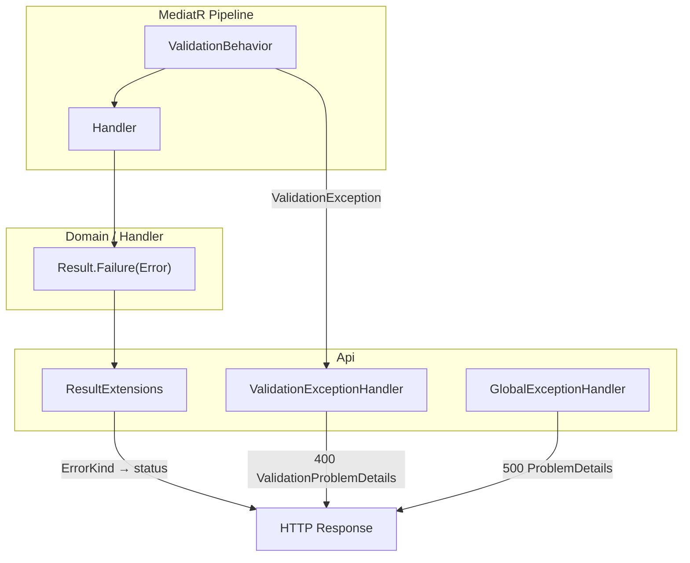

# Error Handling

Three channels for errors. Handlers return **`Result` with structured `Error`** — never HTTP status codes. Api maps `ErrorKind` → status code.

## Overview



| Channel | Source | Mechanism | HTTP |
|---------|--------|-----------|------|
| Input validation | FluentValidation | `ValidationBehavior` → `ValidationException` | 400 |
| Business / not found | Domain, Handler | `Result.Failure(Error(...))` | 404/409/422/403 via `ErrorKind` |
| Unexpected | Infrastructure, bugs | Unhandled exception | 500 |

## Domain Types

```csharp
// Domain/Common/ErrorKind.cs
namespace MyApp.Domain.Common;

public enum ErrorKind
{
    NotFound,        // 404
    Validation,      // 400 — prefer FluentValidation for input; use for domain validation if needed
    Conflict,        // 409
    Forbidden,       // 403
    Unprocessable    // 422 — business rule violation
}
```

```csharp
// Domain/Common/Error.cs
namespace MyApp.Domain.Common;

public sealed record Error(ErrorKind Kind, string Code, string Message)
{
    public static Error NotFound(string code, string message) =>
        new(ErrorKind.NotFound, code, message);

    public static Error Conflict(string code, string message) =>
        new(ErrorKind.Conflict, code, message);

    public static Error Forbidden(string code, string message) =>
        new(ErrorKind.Forbidden, code, message);

    public static Error Unprocessable(string code, string message) =>
        new(ErrorKind.Unprocessable, code, message);

    public static Error Validation(string code, string message) =>
        new(ErrorKind.Validation, code, message);
}
```

```csharp
// Domain/Common/Result.cs
namespace MyApp.Domain.Common;

public class Result
{
    protected Result(bool isSuccess, Error? error)
    {
        IsSuccess = isSuccess;
        Error = error;
    }

    public bool IsSuccess { get; }

    public bool IsFailure => !IsSuccess;

    public Error? Error { get; }

    public static Result Success() => new(true, null);

    public static Result Failure(Error error) => new(false, error);

    public static Result<T> Success<T>(T value) => new(value, true, null);

    public static Result<T> Failure<T>(Error error) => new(default, false, error);
}

public class Result<T> : Result
{
    private readonly T? _value;

    protected internal Result(T? value, bool isSuccess, Error? error)
        : base(isSuccess, error)
    {
        _value = value;
    }

    public T Value => IsSuccess
        ? _value!
        : throw new InvalidOperationException("Cannot access Value on a failed result.");

    public static implicit operator Result<T>(T value) => Success(value);
}
```

## Error Codes

Use **SCREAMING_SNAKE_CASE** stable codes for clients. Message is human-readable and may change.

| Code | Kind | When |
|------|------|------|
| `ORDER_NOT_FOUND` | NotFound | Entity missing |
| `ORDER_NOT_PENDING` | Unprocessable | Business rule: cancel non-pending order |
| `ORDER_ALREADY_EXISTS` | Conflict | Duplicate create |
| `ACCESS_DENIED` | Forbidden | Authorization / policy |

Add codes per aggregate in handler or domain — document in use case folder if non-obvious.

## Handler Usage

Handlers return `Error` — **never** HTTP status codes or `IActionResult`:

```csharp
// Application/Orders/Queries/GetOrder/GetOrderHandler.cs
public async Task<Result<OrderDto>> Handle(GetOrderQuery request, CancellationToken ct)
{
    // ...
    return dto is not null
        ? Result.Success(dto)
        : Result.Failure<OrderDto>(Error.NotFound("ORDER_NOT_FOUND", "Order not found"));
}
```

```csharp
// Application/Orders/Commands/CancelOrder/CancelOrderHandler.cs
public async Task<Result> Handle(CancelOrderCommand request, CancellationToken ct)
{
    var order = await orderRepository.GetByIdAsync(request.OrderId, ct);
    if (order is null)
        return Result.Failure(Error.NotFound("ORDER_NOT_FOUND", "Order not found"));

    var cancelResult = order.Cancel();
    if (cancelResult.IsFailure)
        return cancelResult; // Domain already set Error with code

    await orderRepository.UpdateAsync(order, ct);
    return Result.Success();
}
```

```csharp
// Domain/Entities/Order.cs
public Result Cancel()
{
    if (Status is not OrderStatus.Pending)
        return Result.Failure(Error.Unprocessable(
            "ORDER_NOT_PENDING",
            "Only pending orders can be cancelled"));

    Status = OrderStatus.Cancelled;
    return Result.Success();
}
```

## Api — ResultExtensions

**Single place** that maps `ErrorKind` → HTTP status:

```csharp
// Api/Extensions/ResultExtensions.cs
using Microsoft.AspNetCore.Mvc;
using MyApp.Domain.Common;

namespace MyApp.Api.Extensions;

public static class ResultExtensions
{
    public static IActionResult ToActionResult<T>(this Result<T> result) =>
        result.IsSuccess
            ? new OkObjectResult(result.Value)
            : result.Error!.ToProblemDetailsResult();

    public static IActionResult ToActionResult(this Result result) =>
        result.IsSuccess
            ? new OkResult()
            : result.Error!.ToProblemDetailsResult();

    public static IActionResult ToCreatedResult<T>(
        this Result<T> result,
        ControllerBase controller,
        string actionName,
        object routeValues) =>
        result.IsSuccess
            ? controller.CreatedAtAction(actionName, routeValues, result.Value)
            : result.Error!.ToProblemDetailsResult();

    public static IActionResult ToNoContentResult(this Result result) =>
        result.IsSuccess
            ? new NoContentResult()
            : result.Error!.ToProblemDetailsResult();

    private static IActionResult ToProblemDetailsResult(this Error error) =>
        new ObjectResult(new ProblemDetails
        {
            Title = error.Code,
            Detail = error.Message,
            Status = error.Kind.ToStatusCode(),
            Extensions = { ["errorCode"] = error.Code }
        })
        { StatusCode = error.Kind.ToStatusCode() };

    private static int ToStatusCode(this ErrorKind kind) => kind switch
    {
        ErrorKind.NotFound      => StatusCodes.Status404NotFound,
        ErrorKind.Validation    => StatusCodes.Status400BadRequest,
        ErrorKind.Conflict      => StatusCodes.Status409Conflict,
        ErrorKind.Forbidden     => StatusCodes.Status403Forbidden,
        ErrorKind.Unprocessable => StatusCodes.Status422UnprocessableEntity,
        _                       => StatusCodes.Status400BadRequest
    };
}
```

Controller stays thin — same for all actions:

```csharp
var result = await sender.Send(new CancelOrderCommand(id), ct);
return result.ToNoContentResult(); // 204 or 404/422/409 based on Error.Kind
```

## Api — Exception Handlers

Register in `ConfigureServices`:

```csharp
builder.Services.AddExceptionHandler<ValidationExceptionHandler>();
builder.Services.AddExceptionHandler<GlobalExceptionHandler>();
builder.Services.AddProblemDetails();
```

Add to `ConfigurePipeline` **before** `MapControllers`:

```csharp
app.UseExceptionHandler();
```

### ValidationExceptionHandler

```csharp
// Api/Exceptions/ValidationExceptionHandler.cs
using FluentValidation;
using Microsoft.AspNetCore.Diagnostics;
using Microsoft.AspNetCore.Mvc;

namespace MyApp.Api.Exceptions;

public sealed class ValidationExceptionHandler : IExceptionHandler
{
    public async ValueTask<bool> TryHandleAsync(
        HttpContext httpContext,
        Exception exception,
        CancellationToken cancellationToken)
    {
        if (exception is not ValidationException validationException)
            return false;

        var errors = validationException.Errors
            .GroupBy(e => e.PropertyName)
            .ToDictionary(
                g => g.Key,
                g => g.Select(e => e.ErrorMessage).ToArray());

        var problemDetails = new ValidationProblemDetails(errors)
        {
            Status = StatusCodes.Status400BadRequest,
            Title = "Validation failed"
        };

        httpContext.Response.StatusCode = StatusCodes.Status400BadRequest;
        await httpContext.Response.WriteAsJsonAsync(problemDetails, cancellationToken);
        return true;
    }
}
```

### GlobalExceptionHandler

```csharp
// Api/Exceptions/GlobalExceptionHandler.cs
using Microsoft.AspNetCore.Diagnostics;
using Microsoft.AspNetCore.Mvc;

namespace MyApp.Api.Exceptions;

public sealed class GlobalExceptionHandler(
    ILogger<GlobalExceptionHandler> logger,
    IHostEnvironment environment) : IExceptionHandler
{
    public async ValueTask<bool> TryHandleAsync(
        HttpContext httpContext,
        Exception exception,
        CancellationToken cancellationToken)
    {
        logger.LogError(exception, "Unhandled exception: {Message}", exception.Message);

        var problemDetails = new ProblemDetails
        {
            Status = StatusCodes.Status500InternalServerError,
            Title = "Internal server error",
            Detail = environment.IsDevelopment() ? exception.Message : null
        };

        httpContext.Response.StatusCode = StatusCodes.Status500InternalServerError;
        await httpContext.Response.WriteAsJsonAsync(problemDetails, cancellationToken);
        return true;
    }
}
```

## ErrorKind → HTTP Mapping

| ErrorKind | HTTP | Use when |
|-----------|------|----------|
| `NotFound` | 404 | Entity or resource does not exist |
| `Validation` | 400 | Domain-level validation (prefer FluentValidation for input) |
| `Conflict` | 409 | Duplicate, version mismatch, state conflict |
| `Forbidden` | 403 | Authenticated but not allowed |
| `Unprocessable` | 422 | Business rule violated (order not pending, insufficient balance) |

## Rules

| Rule | Detail |
|------|--------|
| Handler returns `Result` / `Result<T>` | Never `IActionResult`, never `int statusCode` |
| No HTTP in Domain/Application | Only `Error` + `ErrorKind` — semantic, not transport |
| Map HTTP only in Api | `ResultExtensions` + exception handlers |
| Input validation | FluentValidation → `ValidationException` → handler |
| Business errors | `Result.Failure(Error.X(...))` — do not throw |
| Unexpected errors | Let propagate → `GlobalExceptionHandler` → 500 |
| Stable codes | `errorCode` in ProblemDetails extensions for clients |

## Anti-patterns

```csharp
// BAD — HTTP status in handler
return Result.Failure(404, "Not found");

// BAD — throw for expected business case
throw new NotFoundException("Order not found");

// BAD — string-only error without Kind
return Result.Failure("Order not found"); // always maps to wrong status

// BAD — catch ValidationException in controller
try { await sender.Send(...); } catch (ValidationException) { ... }

// GOOD
return Result.Failure(Error.NotFound("ORDER_NOT_FOUND", "Order not found"));
return result.ToActionResult(); // Api maps Kind → 404
```

## Project Layout Additions

```
MyApp.Domain/
  Common/
    Error.cs
    ErrorKind.cs
    Result.cs

MyApp.Api/
  Exceptions/
    ValidationExceptionHandler.cs
    GlobalExceptionHandler.cs
  Extensions/
    ResultExtensions.cs
```

See also: [result-pattern.md](result-pattern.md), [controllers.md](controllers.md), [program-and-di.md](program-and-di.md).
